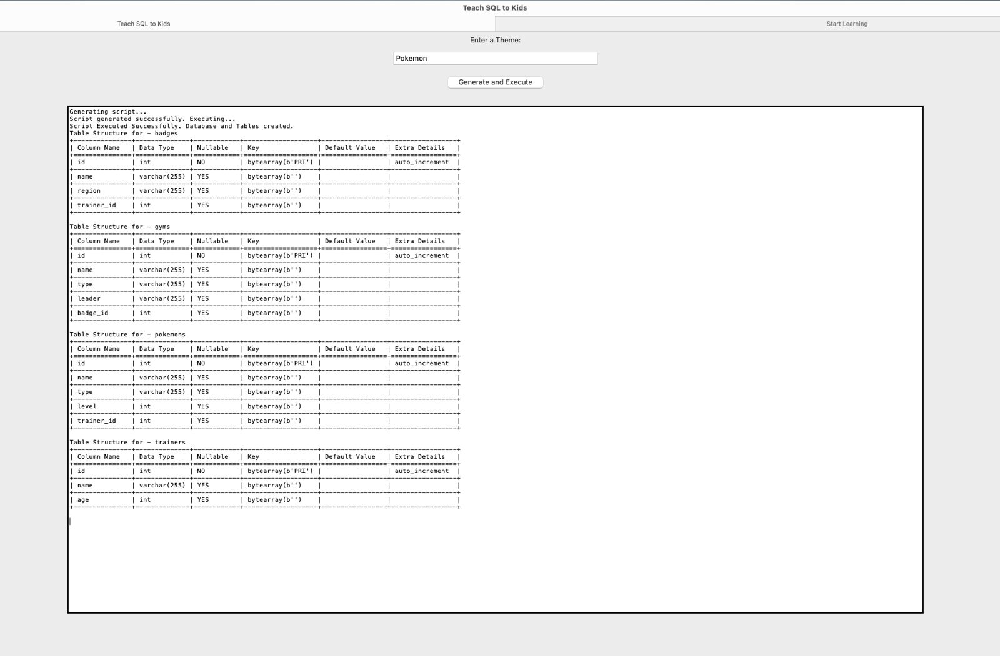
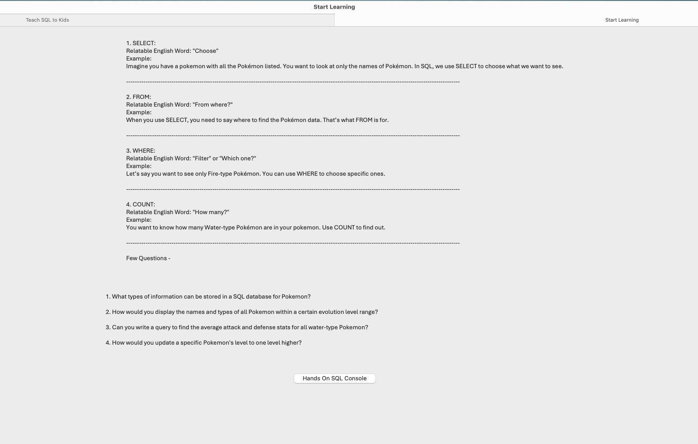
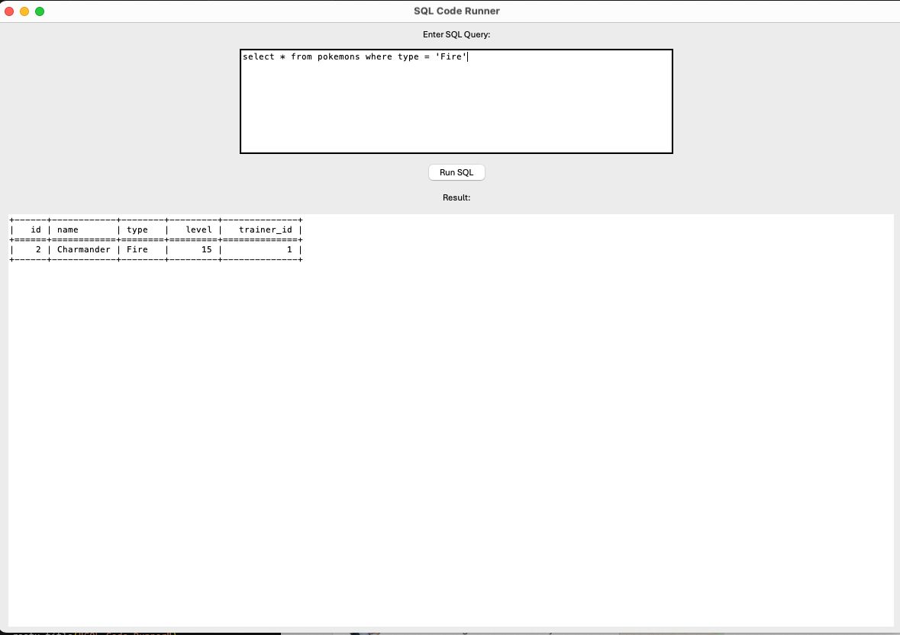

# Personalized Sample Database API for Database and SQL Education

This project revolutionizes SQL education by making database learning engaging, interactive, and personalized, especially for beginners and K-12 students. It uses **Generative AI** to dynamically design databases, create dummy data, and generate SQL practice questions based on user-selected themes (e.g., Pokémon characters).

  

---

## Features
- **Dynamic Database Creation:** Personalized database schemas based on user preferences.
- **Custom Dummy Data Generation:** Realistic data aligned with chosen themes.
- **Interactive SQL Learning:** Practice concepts like `SELECT`, `WHERE`, and `COUNT` with real-time execution.
- **User-Friendly Interface:** Built with Python's **Tkinter** for intuitive interaction.
- **Table Visualization:** Results displayed in a clean, tabular format using `tabulate`.

## Technologies Used
- **AWS RDS:** Reliable cloud-hosted database.
- **OpenAI API:** Real-time schema and content generation.
- **Python Libraries:** 
  - `mysql.connector` for database operations.
  - `Tkinter` for the graphical interface.
  - `tabulate` for result visualization.

## Snapshots

### 1. **Dynamic Schema Creation**
Displays the output after providing a theme. The system dynamically generates schemas with relevant tables and dummy data.  

---

### 2. **SQL Learning Concepts & Practice Questions**
Showcases basic SQL concepts (e.g., `SELECT`, `WHERE`, `COUNT`) with personalized practice questions.  

---

### 3. **SQL Query Editor**
Interactive SQL editor where users can write and run queries on the generated database.  

---

## Key Benefits
- **Personalization:** Tailored learning experiences based on user-selected themes.
- **Hands-On Learning:** Enables students to interact with databases in real time.
- **Flexibility:** Adapts to different skill levels and creative preferences.
- **Engagement:** Turns technical concepts into relatable and enjoyable exercises.

## How It Works
1. User selects a theme (e.g., Pokémon, superheroes, etc.).
2. OpenAI API generates a database schema and dummy data for the theme.
3. Users practice SQL queries on the generated database through the GUI.
4. Results are displayed interactively, fostering better understanding.

## Potential Applications
- Beginner SQL learning.
- K-12 database education.
- Creating tailored database examples for educators.

## Future Work
- Enhance AI-generated schemas for more accuracy.
- Expand interactive features in the GUI.
- Conduct studies to quantify educational benefits.

## Conclusion
This project integrates **AI**, **cloud databases**, and **user-friendly interfaces** to transform SQL education. By making learning flexible, relatable, and hands-on, it provides an impactful and enjoyable way for students to develop database and SQL skills.

---
Feel free to contribute or provide feedback to improve this project!
